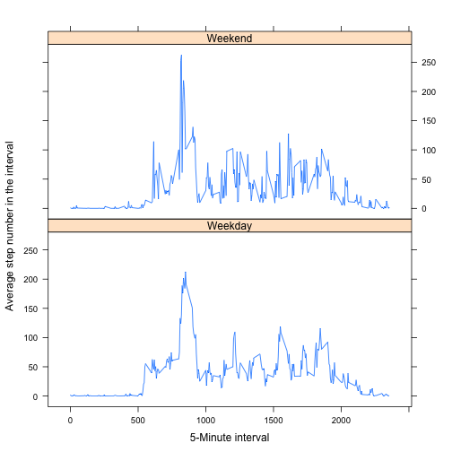

# Reproducible Research: Peer Assessment 1


## Loading and preprocessing the data

We assume the csv file to be in the working directory. The data is loaded, and
dates are converted from string into the R-native date format. Then, the data
undergoes some preprocessing: the total number of steps per day is stored in
the dailysteps variable, and the mean number of steps per time interval is
stored in the intervalsteps variable.

```r
library("plyr")
library("lattice")
rawdata <- read.csv("activity.csv", stringsAsFactors = FALSE)

dates <- strptime(paste(rawdata$date), format = "%Y-%m-%d")
rawdata$date <- dates

dailysteps <- ddply(rawdata, ~date, summarise, total = sum(steps))
intervalsteps <- ddply(rawdata, ~interval, summarise, mean = mean(steps, na.rm = TRUE))
```


## What is mean total number of steps taken per day?

First, plot a histogram containing the distribution of total number of steps per day

```r
xlabel <- "Total number of steps per day"
ylabel <- "Frequency"
title <- "Distribution of total number of steps taken per day"
hist(dailysteps$total, xlab = xlabel, ylab = ylabel, main = title)
```

 

Further, the mean and medium of the total number of steps per day are given below.

```r
mean(dailysteps$total, na.rm = TRUE)
```

```
## [1] 10766
```

```r
median(dailysteps$total, na.rm = TRUE)
```

```
## [1] 10765
```


## What is the average daily activity pattern?

This time series plot shows the daily activity pattern, in that it details
the number of steps taken in a given daily 5-minute interval, averaged over all
days in the observation period. The interval time is given in an 'hhmm' format.

```r
xlabel <- "5-Minute interval"
ylabel <- "Average step number in the interval"
title <- "Daily distribution of steps"
plot(intervalsteps$interval, intervalsteps$mean, type = "l", xlab = xlabel, 
    ylab = ylabel, main = title)
```

 

The maximum number of steps is - on average - about 206 steps, and they are
being made between 8.35am and 8.40am:

```r
max(intervalsteps$mean)
```

```
## [1] 206.2
```

```r
intervalsteps$interval[which.max(intervalsteps$mean)]
```

```
## [1] 835
```


## Imputing missing values

Some of the values in our dataset are missing. In fact, there are 2304 rows with missing step values:

```r
sum(is.na(rawdata$steps))
```

```
## [1] 2304
```


We will impute missing values by filling them with the mean of the 5-minute interval they are in:


```r
# We merge with the intervalsteps data to get the mean for each interval
imputeddata <- merge(rawdata, intervalsteps, by.x = "interval", by.y = "interval")

# This replaces all missing step values by their time interval means
imputeddata$steps[is.na(imputeddata$steps)] <- imputeddata$mean[is.na(imputeddata$steps)]

# Now we drop the time interval means in the imputed data frame again.
imputeddata <- imputeddata[, !names(imputeddata) == "mean"]

# Compute new daily summary
imp_dailysteps <- ddply(imputeddata, ~date, summarise, total = sum(steps, na.rm = TRUE))
```


The data with imputed missing values now has more steps per day in total, and
its distribution is more pronounced in the mean range of steps. The mean has 
not changed under imputation (as one would expect), and the median only changed
very slightly, from 10765 to 10766.

```r
xlabel <- "Total number of steps per day, with missing values imputed"
ylabel <- "Frequency"
title <- "Distribution of total number of steps taken per day,\n          with missing values imputed"
hist(imp_dailysteps$total, xlab = xlabel, ylab = ylabel, main = title)
```

 

```r
mean(imp_dailysteps$total)
```

```
## [1] 10766
```

```r
median(imp_dailysteps$total)
```

```
## [1] 10766
```


## Are there differences in activity patterns between weekdays and weekends?

To find any activity pattern differences between weekdays and weekend days,
we first augment the imputed data set by a variable 'is_weekday' indicating
whether the date is a weekday or a weekend day.
Then, we summarise the mean number of steps per interval, both for weekdays
and weekend days.
Finally, the average daily distribution of steps is plotted both for weekdays
and weekend days.

```r
weekdays <- c("Monday", "Tuesday", "Wednesday", "Thursday", "Friday")
is_weekday <- weekdays(imp_dailysteps$date) %in% weekdays
is_weekday[is_weekday] <- "Weekday"
is_weekday[is_weekday != "Weekday"] <- "Weekend"

imputeddata <- cbind(imputeddata, is_weekday)

imp_wday_intervalsteps <- ddply(imputeddata, .(interval, is_weekday), summarise, 
    mean = mean(steps))

xlabel <- "5-Minute interval"
ylabel <- "Average step number in the interval"
xyplot(mean ~ interval | is_weekday, data = imp_wday_intervalsteps, type = "l", 
    layout = c(1, 2), xlab = xlabel, ylab = ylabel)
```

 

